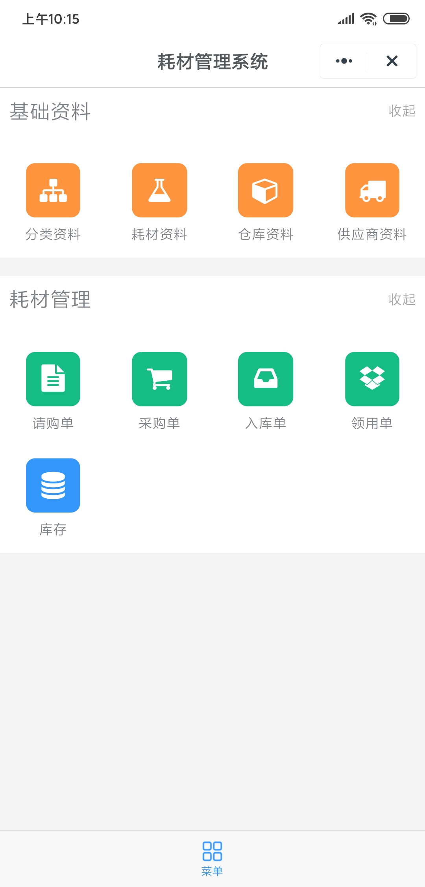
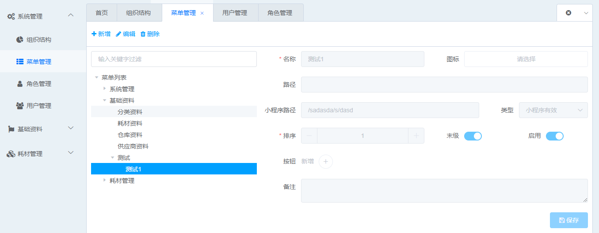
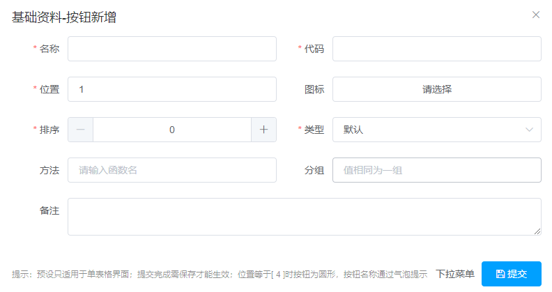

## 介绍

::: warning 注意
菜单的获取请求已经封装好。
:::

根据请求回来的菜单树生成菜单页面，树的层级不设限制，表现形式如下图：



## 生成规律

::: tip 提示
提供一个例子来说明生成规律
:::

树结构如下：

``` js
[{
    menu_name: '根节点',
    children: [
        {
            menu_name: '1',
            children: [
                {
                    menu_name: '1-1',
                    children: [
                        {menu_name: '1-1-1'},
                        {menu_name: '1-1-2'}
                    ]
                },
                {menu_name: '1-2'},
                {menu_name: '1-3'}
            ]
        },
        {
            menu_name: '2',
            children: [
                {menu_name: '2-1'},
                {menu_name: '2-2'},
                {menu_name: '2-3'}
            ]
        },
        {
            menu_name: '3',
            children: []
        }
    ]
}]
```

处理过后生成的菜单结构如下：

``` js
[
    {
        title: '1-1',
        children: [
            {menu_name: '1-1-1'},
            {menu_name: '1-1-2'}
        ]
    },
    {
        title: '1',
        children: [
            {menu_name: '1-2'},
            {menu_name: '1-3'}
        ]
    },
    {
        title: '2',
        children: [
            {menu_name: '2-1'},
            {menu_name: '2-2'},
            {menu_name: '2-3'}
        ]
    }
]
```

## 属性

### column

- 类型: `int`
- 默认值: `4`

每行最大菜单数量。

### disabled

- 类型: `array`
- 默认值: `[]`

禁止显示的菜单，这里考虑了部分功能页面在移动端难以实现。

### staticMenuGroup

- 类型: `array`
- 默认值: `[]`

固定菜单，不需要权限。

### background

- 类型: `string`
- 默认值: `'rgba(0, 0, 0, 0)'`

菜单背景，同css的background。

## 菜单配置

菜单配置需要在**后台操作**，对应菜单为：`系统管理-菜单管理`。

### 新增、修改

点击具体的某个菜单树节点（选中后背景变蓝色），此节点会作为新节点的父节点，然后点击header部分的新增按钮，如下图所示：



- 名称：必填，可修改。
- 图标：菜单的图标，可修改。
- 路径：PC端此菜单对应的页面路由地址。
- 小程序路径：类似**路径**字段，但是仅供小程序使用。

::: warning 注意
小程序路径可传至多两个（后续可能增加）路径，路径使用半角分号分割，菜单的点击事件会默认打开这里配置的第一个路径。
:::

- 类型：菜单背景色。

|类型|颜色|
|-|-|
|主要|<table><tr><td bgcolor=#3296FA>#3296FA</td></tr></table>|
|成功|<table><tr><td bgcolor=#15BC83>#15BC83</td></tr></table>|
|信息|<table><tr><td style="background: rgba(25,31,37,.56)">rgba(25, 31, 37, .56)</td></tr></table>|
|警告|<table><tr><td bgcolor=#F25643>#F25643</td></tr></table>|
|危险|<table><tr><td bgcolor=#FF943E>#FF943E</td></tr></table>|
|默认|无效|
|文字|无效|

- 排序：必填，默认0.
- 按钮：菜单的按钮，只有设置了按钮，并且有角色绑定了至少一个按钮（权限分配），那这个角色对应的账户才能看到此菜单。

### 添加按钮

点击按钮旁边的加号，如下图：



- 名称：按钮显示的文本，必填，可修改。
- 代码：编号，必填。
- 位置：按钮所处位置，必填。
- 图标：按钮图标，显示在文本之前。
- 排序：按钮顺序。
- 类型：按钮背景色，同菜单类型。
- 方法：点击按钮时会调用的方法名。
