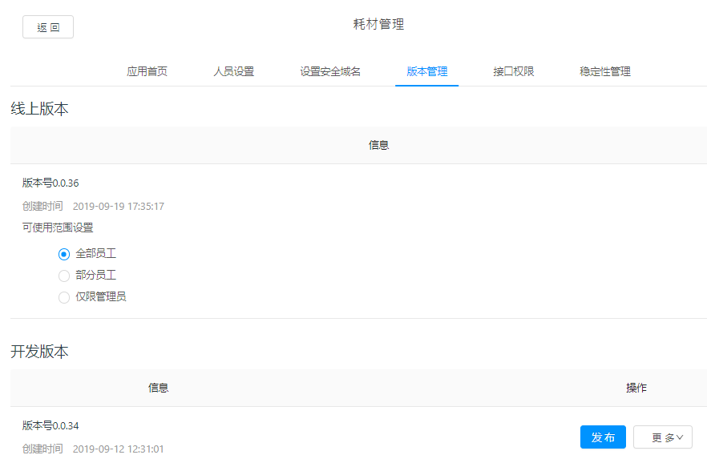

## 快速开始

1. 参考[开放平台](./open-dev)，创建一个小程序
2. 参考[开发工具](./ide)，完成框架引入和关联应用

## 目录结构

框架的目录结构如下：

```
.
├── pages (所有页面文件)
│   ├── home (菜单页)
│   ├── index (初始化载入页)
│   └── ... (业务逻辑页面)
├── src
│   ├── api (接口)
│   │   └── sys (系统接口)
│   │       ├── login.js (登录、刷新接口)
│   │       ├── menu.js (获取菜单接口)
│   │       └── permission.js (获取权限接口)
│   ├── assets (静态文件)
│   │   ├── icon (图标)
│   │   │   ├── base (基础组件用到的图标)
│   │   │   ├── list (列表组件用到的图标)
│   │   │   └── tabBar (底部切换栏用到的图标)
│   │   ├── js
│   │   │   └── RegExp.js (校验方法)
│   │   └── style (样式)
│   │       ├── font-awesome.acss (字体图标)
│   │       └── index.acss (基础样式)
│   ├── components (组件)
│   │   ├── base (基础组件和其他组件)
│   │   ├── e-form (表单组件)
│   │   ├── e-list (列表组件)
│   │   └── e-menu (菜单组件)
│   ├── http
│   │   └── index.js (http)
│   ├── libs
│   │   └── util.js (工具类)
│   ├── mock
│   │   └── index.js (mock数据存放)
│   └── render (渲染函数)
│       ├── formPage.js (表单页面渲染函数)
│       └── listPage.js (列表页面渲染函数)
├── .gitignore (忽略文件)
├── app.acss (app基础样式)
├── app.js (入口文件)
├── app.json (app配置)
└── package.json (包配置)
```
- `src/components/base/e-list/template/index.axml`：列表单项的模板。

## 页面路由

配置文件：`src/app.json`，app.json的所有配置请参考[官方文档](https://ding-doc.dingtalk.com/doc#/dev/framework-app)

示例如下：

``` json
{
	"pages": [
		"pages/index/index",
		"pages/home/index"
	],
	"window": {
		"defaultTitle": "耗材管理系统",
		"titleBarColor": "",
		"pullRefresh": false,
		"allowsBounceVertical": "YES"
	},
	"tabBar": {
		"textColor": "#8A8A8A",
		"selectedColor": "#3296FA",
		"backgroundColor": "",
		"items": [{
				"pagePath": "pages/home/index",
				"name": "菜单",
				"icon": "/src/assets/icon/tabBar/apps.png",
				"activeIcon": "/src/assets/icon/tabBar/apps_active.png"
			}
		]
	}
}
```

## 配置

### 域名设置

文件位置：`src\app.js`，globalData.host字段，此字段会加在所有请求之前。

### 初始化页组织名称

文件位置：`src\app.js`，globalData.corp字段，此字段会显示在登录载入页面的下方。

### 组织logo

文件位置：`src\app.js`，globalData.logo字段，logo会显示在组织名称的正上方。

### token刷新间隔

文件位置：`src\api\sys\login.js`，REFRESH_INTERVAL字段，默认15分钟，单位毫秒。

## 样式

文件位置：`src\assets\style\index.acss`

::: tip 提示
小程序通过class定义样式存在样式污染问题，所以通过定义大量基础样式class，通过基础样式组合达成想要效果，此做法的优点是可以解决样式污染问题，且样式统一，缺点是class数量多，使用者需要一定时间来熟悉。
:::

## 图标

文件位置：`src\assets\style\font-awesome.acss`，[图标参考](http://www.fontawesome.com.cn/faicons/)

使用方法为定义class为：fa fa-name。

## 工具类

文件位置：`src\libs\util.js`

### formatUrl

- 用途：合并url和query参数
- 参数：url地址`string`，query参数`object`
- 返回：url地址`string`

### formatDate

- 用途：格式化日期对象
- 参数：格式化规则`string`，Date对象`Date`
- 返回：url地址`string`

### ddToast

- 用途：全局toast
- 参数：{类型`string`, 内容`string`, 时长`int`}

### sleep

- 用途：暂停
- 参数：市场`int`
- 返回：`Promise`

用法如下：
```js
await sleep(3000)
```

### setNavigationBar

- 用途：设置导航栏
- 参数：{标题`string`, 重置`boolean`, 背景颜色`string` }

### cloneDeep

- 用途：深拷贝
- 参数：`obejct`
- 返回：`obejct`

::: warning 注意
简易深拷贝，不能拷贝函数。
:::

### debounce

- 用途：去抖函数
- 参数：`function`，间隔`int`（默认1秒）
- 返回：`function`

### equal

**存在问题，不要使用**

- 用途：判断a、b是否相等，关注**值**，可判断对象。

### db.set

- 用途：本地缓存写入
- 参数：{ dbName`string`, path`string`, value`string`, user`boolean` }
- 返回：`Promise`

### db.get

- 用途：本地缓存读取
- 参数：{ dbName`string`, path`string`, defaultValue`string`, user`boolean` }
- 返回：`Promise`

### db.remove

- 用途：本地缓存删除
- 参数：{ dbName`string`, path`string`, user`boolean` }
- 返回：`Promise`

### getMenu

- 用途：获取当前菜单信息
- 参数：`route`
- 返回：`object`

route获取如下：

```js
this.route
```

### getComponentById

- 用途：获取组件实例
- 参数：id`string`
- 返回：`object`

## 发布

1. 点击登录旁边的**上传**按钮
2. 登录开放平台，选择对应小程序
3. 点击版本管理，如下图
    
4. 选择对应版本点击发布

::: warning
小程序发布后，需要杀死原有进程重新打开，才能获取到最新版本，否则会因为缓存问题显示旧版本。
:::