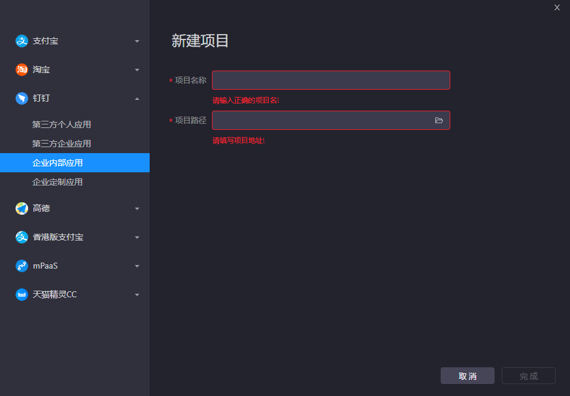

## 下载地址

[钉钉小程序开发工具](https://ding-doc.dingtalk.com/doc#/kn6zg7/zunrdk)

## 项目创建

::: tip 提示
项目创建请选择：钉钉-企业内部应用
:::



## 框架引入

1. 将本小程序框架（[源码](https://github.com/cjl255352/e-app)）克隆至本地，并安装依赖。
``` sh
git clone https://github.com/cjl255352/e-app.git
npm i
```
2. 点击打开项目，选择框架
3. 选择并确认项目类型
4. 点击完成

## 关联应用


1. 登录IDE工具
2. 左侧选择企业内部应用
2. 选择关联的应用（之前创建的应用）