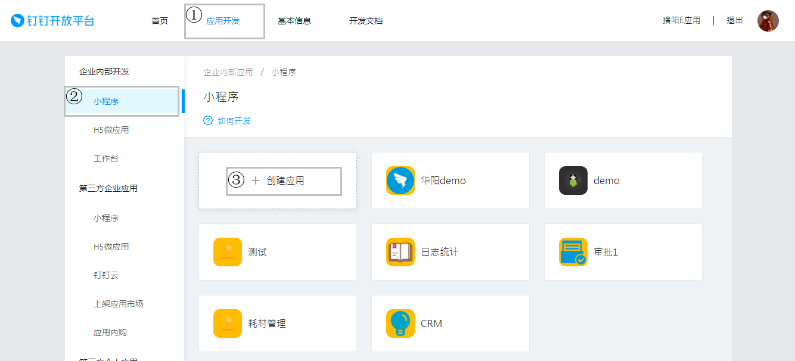

# 介绍

::: tip 提示
确保你是管理员或自管理员。
:::

[钉钉开放平台](https://open-dev.dingtalk.com)是企业用于管理发布自己的小程序或微应用的管理后台，自开发应用的创建、管理、配置都在这里完成，本文档只关注小程序的开发。

## 创建小程序

1. 登录开放平台
2. 如下图

3. 基本信息填写
    - 应用名称：必填，可后续修改。
    - 应用logo：必填，可后续修改。
    - 应用简介：必填，可后续修改。
    - 开发方式：必填，选择企业内部自主开发。
4. 点击下一步
5. 基本信息填写（续）
    - 开发模式：必填，选择开发应用。
    - 开发应用类型：必填，选择小程序。
    - 服务器出口ip：必填，可后续修改。

    ::: warning 注意
    服务器出口ip与前端代码开发关系不大，可以先随便设置，之后再修改（询问后台开发人员）成正确的ip。
    :::

    - PC端首页地址：选填，可修改。

    ::: warning 注意
    如果不填，PC端钉钉没有此应用图标，如果填写，需要另外匹配PC端应用。
    :::

    - 管理后台地址：选填，可修改，目前不用填写。

## 配置小程序

小程序创建完成后需要配置才能进行代码开发和发布。

### 人员设置

::: warning 注意
只有设置为开发人员的用户可以进行应用开发。
:::

1. 选择人员设置
2. 点击添加人员

### 安全域名

1. 点击安全域名设置
2. 询问后台并填写

### 接口权限

::: warning 注意
此设置与前端开发无关系，与后台调用钉钉开放能力相关，只有打开授权，才能使用对应接口。
:::

1. 点击接口权限
2. 设置需要开放的接口权限

